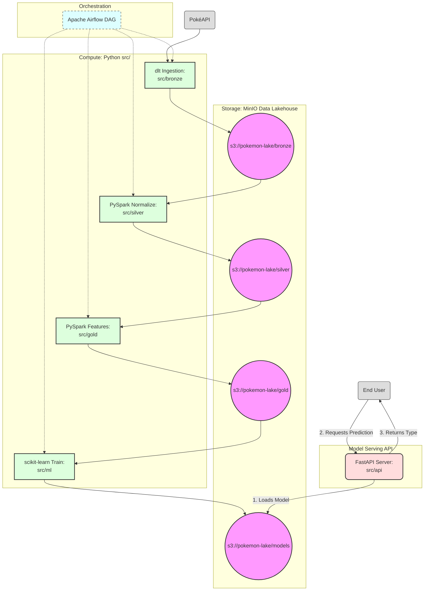

# ⚡ Pokémon AI Lakehouse & ML Pipeline ⚡

An end-to-end Data Engineering and Machine Learning project that extracts Pokémon data from the PokéAPI, processes it via a **Medallion Architecture**, and trains a state-of-the-art classifier to predict a Pokémon's primary type based on its combat stats and physical characteristics.

Built with an **AI-Assisted Development** workflow using **Google Antigravity**.

---

## 🏗️ Architecture & Tech Stack

This project follows a professional data lakehouse pattern:

1.  **Ingestion (Bronze 🥉):** [**dlt (Data Load Tool)**](https://dlthub.com/) - Extracts full nested JSON details from PokéAPI and loads them as `JSONL` into MinIO.
2.  **Processing (Silver 🥈):** **PySpark** - Normalizes nested structures, extracts stats (`hp`, `attack`, etc.) and types using safe extraction logic.
3.  **Feature Store (Gold 🥇):** **PySpark** - Engineers high-quality features, including `height`, `weight`, and combat stats, ready for modeling.
4.  **Machine Learning:** **scikit-learn** -
    * **Preprocessing:** `PolynomialFeatures` to capture stat interactions.
    * **Model:** `HistGradientBoostingClassifier` (tuned via `GridSearchCV`).
    * **Evaluation:** Detailed metrics via `classification_report`.
5.  **Orchestration:** **Apache Airflow** (via Astro CLI) - Manages the dependency graph and schedules the daily pipeline.
6.  **Serving:** **FastAPI** - Exposes a REST API to serve predictions in real-time.
7.  **Storage:** **MinIO** - S3-compatible object storage running in Docker.

## 📂 Project Structure

    ├── agent_skills/     # 🧠 Context files for AI-Assisted development
    ├── dags/             # ✈️ Airflow DAGs (Pipeline orchestration)
    ├── infra/            # 🐳 Docker Compose for MinIO & Infrastructure
    ├── models/           # 🤖 Serialized ML models (.pkl)
    ├── src/              # 🏗️ Core Python scripts per layer
    │   ├── api/          # FastAPI serving script
    │   ├── bronze/       # Ingestion logic (dlt)
    │   ├── silver/       # PySpark normalization
    │   ├── gold/         # PySpark feature engineering
    │   └── ml/           # Model training and evaluation
    └── requirements.txt  # Project dependencies

## 🚀 How to Run Locally

### 1. Prerequisites
- **Python 3.10+**
- **Docker & Docker Compose**
- **Astro CLI**

### 2. Infrastructure Setup
Start the local MinIO instance:

    cd infra && docker-compose up -d

### 3. Environment Configuration
Create a `.env` file in the root directory (refer to `agent_skills/dlt_ingestion/.env.example` for required keys).

### 4. Setup Environment

    python -m venv venv && source venv/bin/activate
    pip install -r requirements.txt

### 5. Orchestration (Airflow)
Start the Astro environment:

    astro dev start

Go to `http://localhost:8080` (admin/admin) and trigger the `pokemon_lakehouse_pipeline` DAG.

### 6. Model Serving (FastAPI)
With the model trained and securely stored in our Data Lakehouse (MinIO), you can spin up the FastAPI server to make real-time predictions.

Start the local server:

    uvicorn src.api.main:app --reload

Open your browser and navigate to the interactive Swagger UI:
`http://localhost:8000/docs`

You can test the `POST /predict` endpoint by providing the combat stats of a Pokémon. Here is an example payload (representing Pikachu):

    {
      "hp": 35,
      "attack": 55,
      "defense": 40,
      "special_attack": 50,
      "special_defense": 50,
      "speed": 90,
      "height": 4,
      "weight": 60
    }

---
